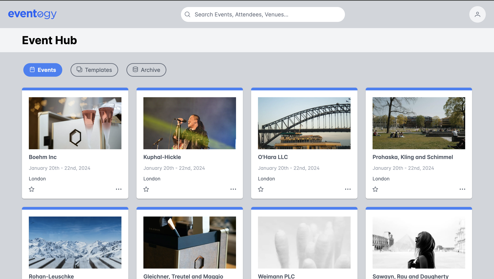
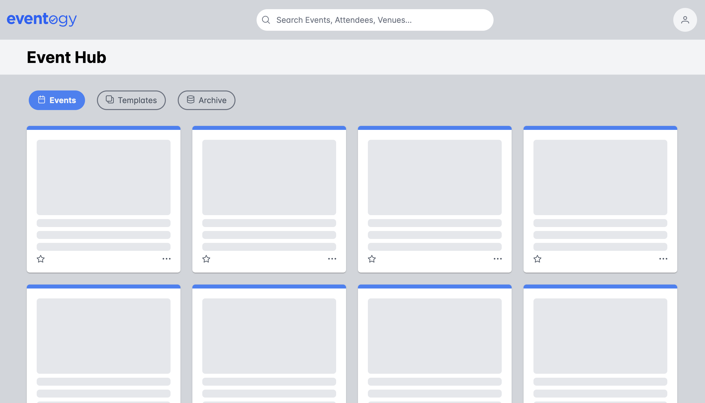
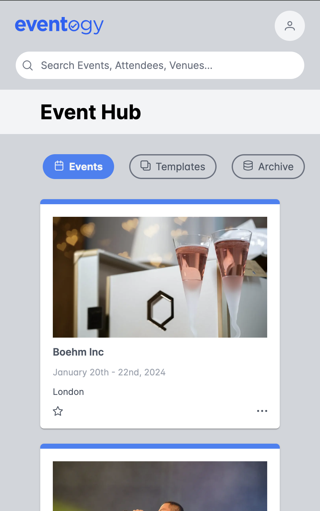

# Javascript Tech Task Solution

## Main screenshots

### Events list

### Events list loading

### Responsive layout

## Comments on the task

- As many components as possible are server side components (only [Error](../app/error.tsx) and [ActiveLink](../app/ui/ActiveLink.tsx) are on the client side)
- 3 pages are added to the app (main page with Events; Template and Archive with template content). Navigating between pages is done using `Link` from next.js to avoid page rerender on navigate.
- Showing loaders when list of events is being loaded is implemented using streaming - uncomment timeout in [actions.ts](../app/lib/actions.ts)
- Did not aim to make layout 100% matching the screenshot, but aimed to demonstrate ability to work with responsive layout, images of different dimensions, icons, fonts, flex and grid layout
- As date format in the design is a bit incorrect, I came up with my own [date format](../app/lib/helpers.ts)
